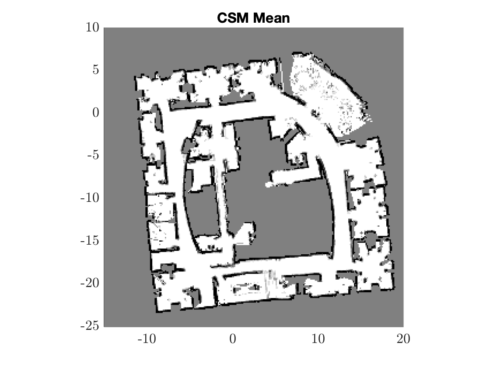
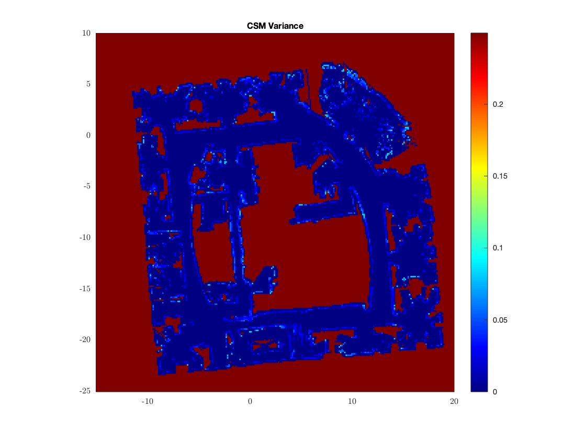

# Mobile-Robotics
## [PS1](Mobile-Robotics/ps1/): First-Order Covariance Propagation
In this task, we discussed about the linearization error we met during the SLAM procedure. Often the linearization process is required for that some of the filter could only operated linearized and Gaussian system. 
I first generate a point cloud representing 10,000 samples form the distribution over the position of the object as measured sensor frame (i.e. r,) and the Cartesian (x,y) coordinate frame. It was generated by utilizing  + . 

As shown in the following picture, since the analytical Cartesian frame is the frame being linearized, the red(calculated covariance and mean) and blue(sampled covariance and mean) ellipse wouldn’t match. It would lose some information when linearization. 

  

This question utilized different covariance matrix with  to plot the sensor frame and cartesian frame. Covariance values were then calculated:

.

Also, we could draw the sample with the following equations:

X is just another random value and . By plugging in the L value, we could produce new data point and plot as the new Sensor Frame in the above figure. The data is no longer independent within their two coordinates. When transformed by Jacobian, the sample-based covariance contours are being off with the calculated contours. As long as the correlation value gets bigger, the red and blue contour differs even further. 

  

## [PS2](Mobile-Robotics/ps2/): Filters and Propagation
This homework is meant to deal with extented kalman filter(EKF), unscented kalman (UKF), and particle filter(PF).
| EKF | UKF | PF |
| :---: |:---:| :---:|
|   |  |   |

## [PS3](Mobile-Robotics/ps3/) : Senor Model
In this task, both discrete and continuous sensor models for occupancy grid maps and semantic grid maps are implemented. Also, it is then evaluated with [Intel dataset](https://lucacarlone.mit.edu/datasets/).

I first utilize inverse sensor model to detect whether the hit point is within certain distance and certain geometry pattern from the query point. We then refreshed the α value and β value. 

| mean | variance |
| :---: |:---:|
|   |  |

The "continuous" counting sensor model is then implemented as in mentioned in this paper[1](ps3/References paper/Bayesian Spatial Kernel Smoothing for Scalable.pdf)[2](ps3/References paper/Learning-Aided 3-D Occupancy Mapping With Bayesian Generalized Kernel Inference.pdf). The Bayesian Generalized Kernel Inference is meant to be set up the kernel or say the weight that corresponds to the distance to the query points and the position of the LIDAR. The Semantic counting sensor model is also being implemented as following:

| mean | variance |
| :---: |:---:|
|   |  |
